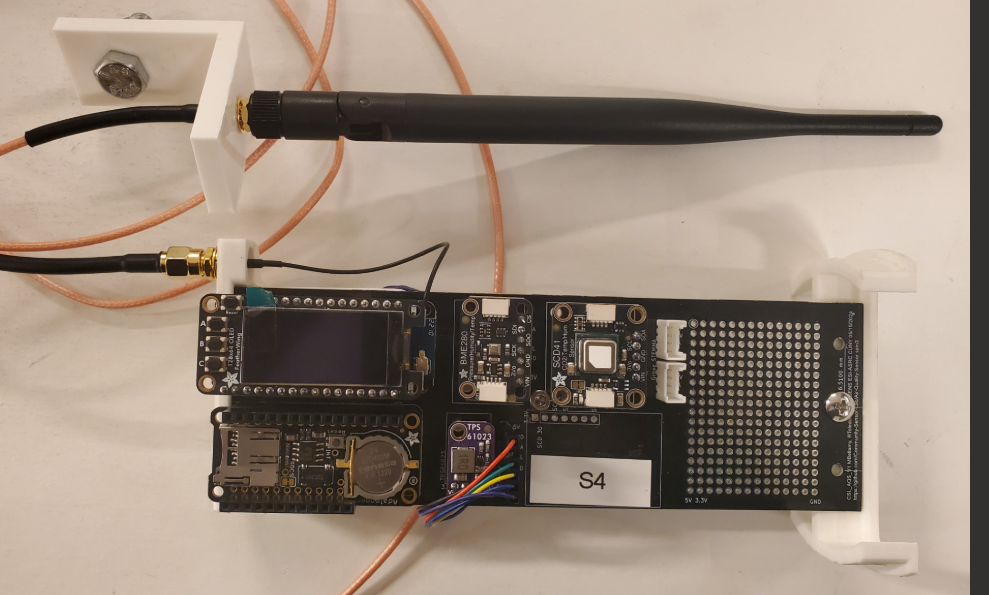
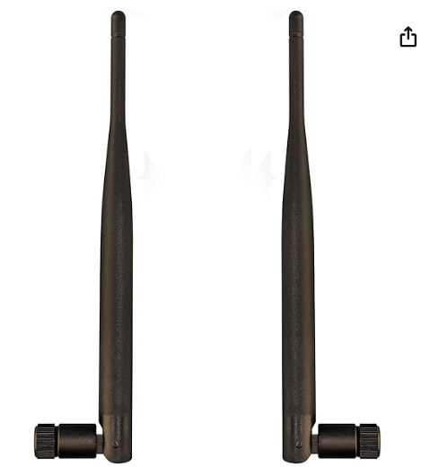

 # External Antenna
### For the circumstances where the sensor cannot be place in an optimal position; the antenna resolves this issue.

Welcome to the Community Sensor Lab's new addition, an external antenna. This antenna builds upon the current AQS with the following components: 
* Adafruit Feather M0 WiFi with uFL
* WI-FI/Bluetooth Antenna 2.4/5.8GHZ
* SMA Female to IPX U.FL 
* SMA Antenna Extension Cable (6 ft) 
* SEN5X Mount V4 Antena.ipt (From our Content M_CAD Folder) 

 

## Content
### Antenna Additions
* Parts List

## Antenna Additions
### Parts List

| Part Name | Part Image | Purchase Link|
|----------|--------|:-----------------------:|
|Adafruit Feather M0 WiFi with uFL|  |[Adafruit](https://www.adafruit.com/product/3061)
|WI-FI/Bluetooth Antenna 2.4/5.8GHZ|  |[Amazon](https://www.amazon.com/Dixingtek-SMA-Connector-Compatible-Security/dp/B0F2SMFZ9L/ref=sr_1_7_sspa?crid=2PVNTI45QP99J&dib=eyJ2IjoiMSJ9.NzxrlJpnR_syAdELOctHHL2K7WTR-dw5yUm09TOeYL3tbiLv06n2oWH2GLiVq_uxdCUi3xCqSuXxKHSlNp-8kYdlCifX0RzFsv8nXoR1tl62a0JiWV480u9Baf9mzE0ma8mc4fFfuCd7Y3jOilnjS-WHzqv0nMTpHaotNuaybWnM3FMikAo0glmskzXJIORGdP2Qx2vZMXKGw7mhHrHvewj6xoUurPZPFiuEL4M5FaQ.mrwPbuXCm6L-f3rBh9mlKU1huQljYmQrX4njlvJYz28&dib_tag=se&keywords=WI-FI%2FBluetooth%2BAntenna%2B2.4Ghz%2Bsma&qid=1763147988&sprefix=wi-fi%2Fbluetooth%2Bantenna%2B2.4ghz%2Bsma%2Caps%2C66&sr=8-7-spons&sp_csd=d2lkZ2V0TmFtZT1zcF9tdGY&th=1)
|SMA Female to IPX U.FL|  |[Aliexpress](https://www.aliexpress.us/item/3256801652059536.html?src=google&snpsid=201797907&sellerId=201797907&storeId=714180&bus_lab=y&traffic_server_nav=true&pdp_npi=4%40dis%21USD%212.30%212.11%21%21%21%21%21%402101fddd17628804106087201da198%2112000017804979200%21ppc%21%21%21&snps=y&src=google&albch=shopping&acnt=897-548-8760&isdl=y&slnk=&plac=&mtctp=&albbt=Google_7_shopping&aff_platform=google&aff_short_key=_oEDJ7Ho&gclsrc=aw.ds&albagn=888888&ds_e_adid=745016995142&ds_e_matchtype=search&ds_e_device=c&ds_e_network=g&ds_e_product_group_id=2399415926790&ds_e_product_id=en3256801652059536&ds_e_product_merchant_id=5551326180&ds_e_product_country=US&ds_e_product_language=en&ds_e_product_channel=online&ds_e_product_store_id=&ds_url_v=2&albcp=22423954445&albag=174625099621&isSmbAutoCall=false&needSmbHouyi=false&gad_source=1&gad_campaignid=22423954445&gbraid=0AAAAAoukrzjGJRydhzk5306L8SBpVP4J1&gclid=CjwKCAiA2svIBhB-EiwARWDPjlS7SZMbe2EUm-WqippgbLYCfLkx88JC--N7q0mUMEUJriHOxcED-xoC3y4QAvD_BwE&gatewayAdapt=glo2usa4itemAdapt)
|SMA Antenna Extension Cable (6 ft)|  |[Amazon](https://www.amazon.com/dp/B0CL4P2LSS/ref=sspa_dk_detail_4?pd_rd_i=B0CL4M6KJ5&pd_rd_w=z0ygB&content-id=amzn1.sym.30062d3d-2c31-47f3-af26-55177a669bb5&pf_rd_p=30062d3d-2c31-47f3-af26-55177a669bb5&pf_rd_r=YFH6YH9G8TQ3XX8R283X&pd_rd_wg=WKekV&pd_rd_r=6b64455c-6c9e-4ab4-953c-33df5273b079&sp_csd=d2lkZ2V0TmFtZT1zcF9kZXRhaWxfdGhlbWF0aWM&th=1)
