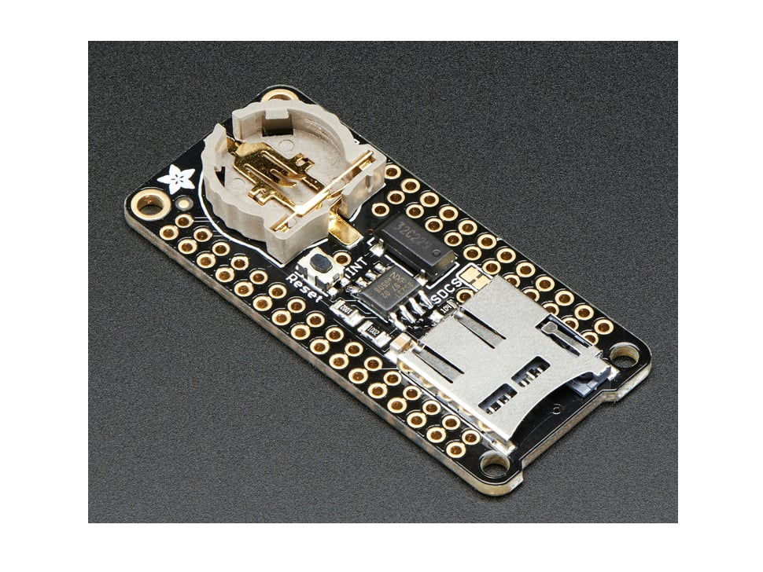
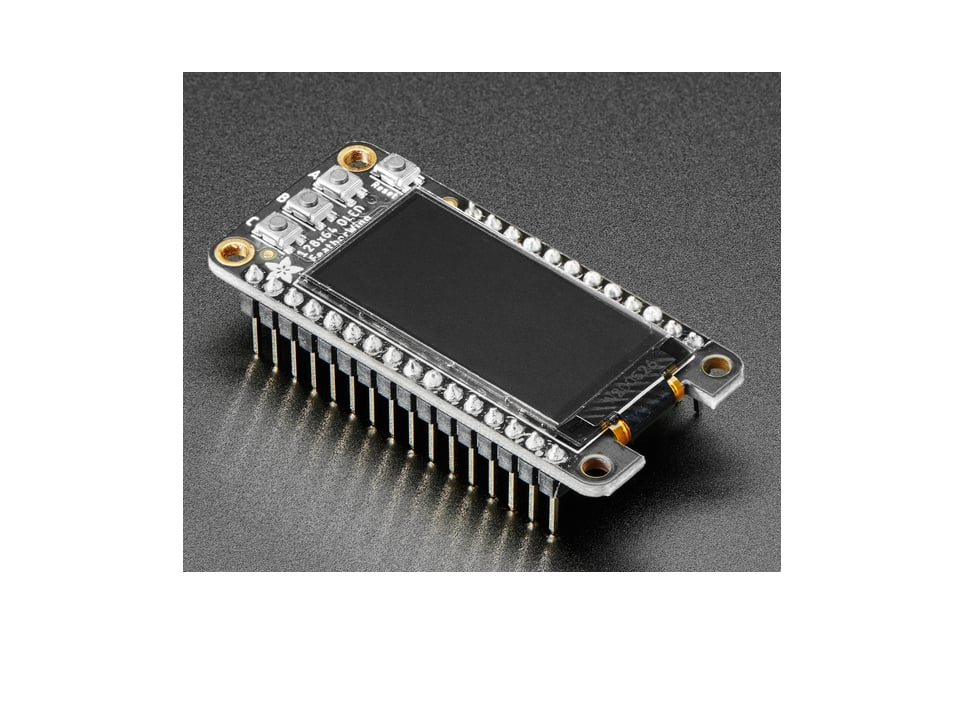
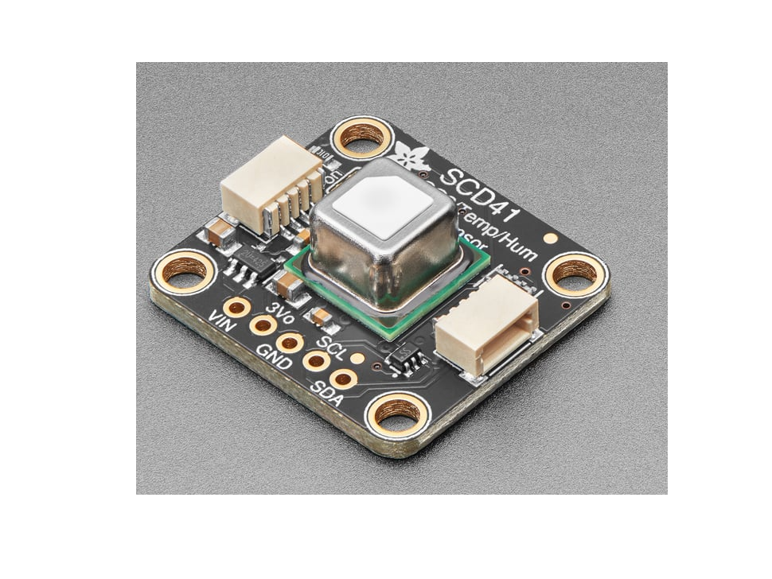
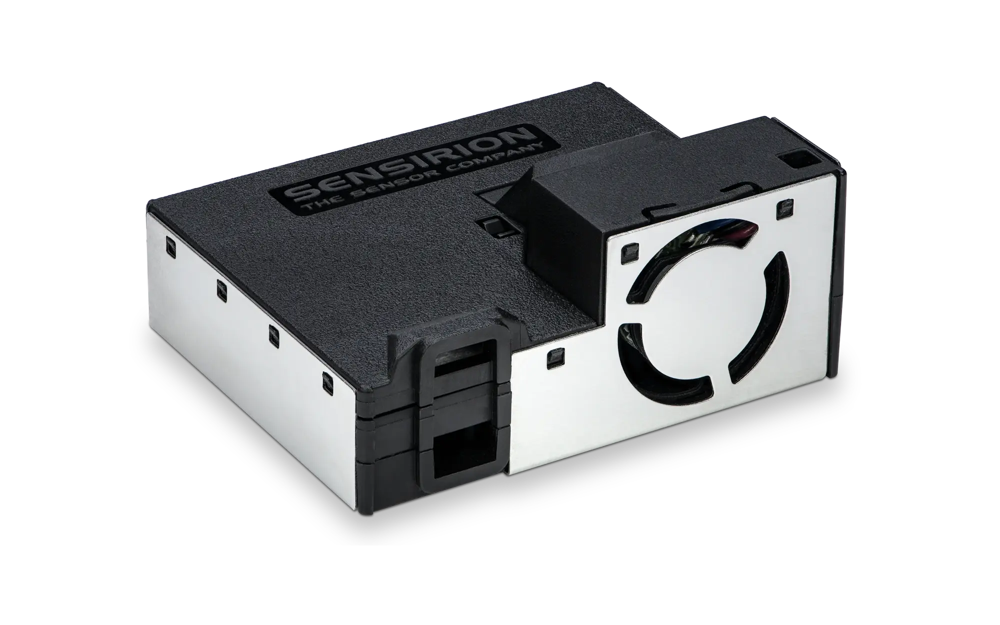

**Adafruit Feather (Arduino) Components**

| Component | Image | Description | Link |
| :---- | :---- | :---- | :---- |
| Feather M0 WiFi (WINC1500) |  | Microcontroller CPU, battery charger and WiFi Radio. The 'brains' of the system. | [https://www.adafruit.com/product/3010](https://www.adafruit.com/product/3010) |
| Addalogger Featherwing: RTC & MicroSD |  | Real-time Clock and MicroSD Read/Write. It is the 'hard drive' data storage of the system. It also has a Real Time Clock (RTC) to keep date and time even when turned off. | [https://www.adafruit.com/product/2922](https://www.adafruit.com/product/2922) |
| Featherwing OLED 128x64 |  | The Organic Light Emmitting Diode (OLED) Display provides visual information from the system. | [https://www.adafruit.com/product/4650](https://www.adafruit.com/product/4650) |

**Sensors**

| Component | Image | Description | Link |
| :---- | :---- | :---- | :---- |
| Adafruit SCD41 CO2 |  | CO2 Sensor | [https://www.adafruit.com/product/5190](https://www.adafruit.com/product/5190) |
| BME280 Temp. Press. Rel Humidity |  | Temp. Pressure Humidity Sensor | [https://www.adafruit.com/product/2652](https://www.adafruit.com/product/2652) |
| Sensirion SEK-SEN5X |  | Particulapngte Matter/VOC/NOX Sensor | [https://www.digikey.com/en/products/detail/sensirion-ag/SEN55-SDN-T/16342756](https://www.digikey.com/en/products/detail/sensirion-ag/SEN55-SDN-T/16342756) |

**Additional Parts**

| Part | Image | Description | Link |
| :---- | :---- | :---- | :---- |
| MiniBoost 5V | ![][image7] | 3.3 to 5 Voltage Converter | [https://www.adafruit.com/product/4654](https://www.adafruit.com/product/4654) |
| Battery Coin cr1220 | ![][image8] | Battery (Coin) | [https://www.digikey.com/en/products/detail/renata-batteries/RENATA-CR1220-TS-1/13283109](https://www.digikey.com/en/products/detail/renata-batteries/RENATA-CR1220-TS-1/13283109) |
| Micro SD | ![][image9] | (Physical) Data Storage | [https://www.digikey.com/en/products/detail/delkin-devices-inc/USDCOEM-16GB/13882332](https://www.digikey.com/en/products/detail/delkin-devices-inc/USDCOEM-16GB/13882332) |
| 4 Pin Headers | ![][image10] | 4 Pin Header for 3.3 to 5 Volt. Converter | [https://www.digikey.com/en/products/detail/sullins-connector-solutions/PPTC041LFBN-RC/810144](https://www.digikey.com/en/products/detail/sullins-connector-solutions/PPTC041LFBN-RC/810144) |
| 5 Pin Headers | ![][image11] | 5 Pin Header for SCD 41  | [https://www.digikey.com/en/products/detail/sullins-connector-solutions/PPTC051LFBN-RC/807239](https://www.digikey.com/en/products/detail/sullins-connector-solutions/PPTC051LFBN-RC/807239) |
| 6 Pin Headers | ![][image12] | 6 Pin Header for Particulate Matter Sensor | [https://www.digikey.com/en/products/detail/w%C3%BCrth-elektronik/61300611821/16608482](https://www.digikey.com/en/products/detail/w%C3%BCrth-elektronik/61300611821/16608482) |
| 7 Pin Headers | ![][image13] | 7 Pin Header for BME280 and SCD30 | [https://www.digikey.com/en/products/detail/sullins-connector-solutions/PPTC071LFBN-RC/810146](https://www.digikey.com/en/products/detail/sullins-connector-solutions/PPTC071LFBN-RC/810146) |
| 12 Pin Headers | ![][image14] | 12 Pin Header for Feather Logger and M0 | [https://www.digikey.com/en/products/detail/sullins-connector-solutions/PPTC121LFBN-RC/807231](https://www.digikey.com/en/products/detail/sullins-connector-solutions/PPTC121LFBN-RC/807231) |
| 16 Pin Headers | ![][image15] | 16 Pin Header for Feather Logger and M0 | [https://www.digikey.com/en/products/detail/sullins-connector-solutions/PPTC161LFBN-RC/810154](https://www.digikey.com/en/products/detail/sullins-connector-solutions/PPTC161LFBN-RC/810154) |
| Feather Stacking Header Set | ![][image16] | Stacking header for Feather M0 | [https://www.adafruit.com/product/2830](https://www.adafruit.com/product/2830) |
| Grove Female Header \- DIP-4P-2.0mm | ![][image17] | i2c Grove Connector | [https://www.seeedstudio.com/Grove-Universal-4-pin-connector.html](https://www.seeedstudio.com/Grove-Universal-4-pin-connector.html) |
| CSL\_AQS\_V1 PCB Board (KiCAD) | ![][image18] | PCB Board | [https://www.pcbway.com/](https://www.pcbway.com/) [https://github.com/Community-Sensor-Lab/Air-Quality-Sensor/tree/CSL\_AQS\_V5](https://github.com/Community-Sensor-Lab/Air-Quality-Sensor/tree/CSL_AQS_V5) |
| PVC Tube | ![][image19] | PVC 3 Inch Diameter 7 Inch LengthTube | [https://www.homedepot.com/p/Charlotte-Pipe-3-in-x-2-ft-PVC-DWV-Sch-40-Pipe-PVC073000200HA/100533056](https://www.homedepot.com/p/Charlotte-Pipe-3-in-x-2-ft-PVC-DWV-Sch-40-Pipe-PVC073000200HA/100533056) |
| PVC Cap | ![][image20] | PVC Cap 3 Inch Diameter | [https://www.homedepot.com/p/3-in-PVC-DWV-Cap-PVC001161000HD/203393254](https://www.homedepot.com/p/3-in-PVC-DWV-Cap-PVC001161000HD/203393254) |
| Type C Cable | ![][image21] | Micro USB Cable | [https://www.amazon.com/Ruaeoda-Micro-Android-Charger-Gold-Plated/dp/B0D7RZJSPS/ref=sr\_1\_10?s=industrial\&sr=1-10](https://www.amazon.com/Ruaeoda-Micro-Android-Charger-Gold-Plated/dp/B0D7RZJSPS/ref=sr_1_10?s=industrial&sr=1-10)  |
| Grainger \#6 Screw | ![][image22] | 6-32 x 1/2'' Socket Head Screw | [https://www.mcmaster.com/catalog/130/3555/92196A146](https://www.mcmaster.com/catalog/130/3555/92196A146)  |
| Grainger \#6 Screw | ![][image23] | 6-32 x 1/2'' Phillip Head Screw | [https://a.co/d/00aQRtf8](https://a.co/d/00aQRtf8) |
| 6\#-32 Lock Nuts | ![][image24] | 6\#-32 Lock Nuts | [https://www.amazon.com/dp/B09V2SMKCS?ref=cm\_sw\_r\_cp\_ud\_dp\_85DV0K4XSP3YVNZTQ9CF\&ref\_=cm\_sw\_r\_cp\_ud\_dp\_85DV0K4XSP3YVNZTQ9CF\&social\_share=cm\_sw\_r\_cp\_ud\_dp\_85DV0K4XSP3YVNZTQ9CF\&skipTwisterOG=2\&th=1](https://www.amazon.com/dp/B09V2SMKCS?ref=cm_sw_r_cp_ud_dp_85DV0K4XSP3YVNZTQ9CF&ref_=cm_sw_r_cp_ud_dp_85DV0K4XSP3YVNZTQ9CF&social_share=cm_sw_r_cp_ud_dp_85DV0K4XSP3YVNZTQ9CF&skipTwisterOG=2&th=1)  |
| 11mm, M2.5 Standoffs | ![][image25] | 100 Pcs M2.5 11mm Standoffs | [https://www.amazon.com/dp/B0BK99T8S4?\_encoding=UTF8\&psc=1\&ref=cm\_sw\_r\_cp\_ud\_dp\_NJHTWAXYMZAMQTEPGTWG\&ref\_=cm\_sw\_r\_cp\_ud\_dp\_NJHTWAXYMZAMQTEPGTWG\&social\_share=cm\_sw\_r\_cp\_ud\_dp\_NJHTWAXYMZAMQTEPGTWG\&skipTwisterOG=2](https://www.amazon.com/dp/B0BK99T8S4?_encoding=UTF8&psc=1&ref=cm_sw_r_cp_ud_dp_NJHTWAXYMZAMQTEPGTWG&ref_=cm_sw_r_cp_ud_dp_NJHTWAXYMZAMQTEPGTWG&social_share=cm_sw_r_cp_ud_dp_NJHTWAXYMZAMQTEPGTWG&skipTwisterOG=2)  |
| Hex Nuts, M2.5x0.45mm | ![][image26] | 100 Pcs M2.5x0.45mm Hex Nuts | [https://www.amazon.com/dp/B07H3WGLJN?\_encoding=UTF8\&psc=1\&ref=cm\_sw\_r\_cp\_ud\_dp\_YWEFJ3H8FVGTAFAJ55B1\&ref\_=cm\_sw\_r\_cp\_ud\_dp\_YWEFJ3H8FVGTAFAJ55B1\&social\_share=cm\_sw\_r\_cp\_ud\_dp\_YWEFJ3H8FVGTAFAJ55B1\&skipTwisterOG=2](https://www.amazon.com/dp/B07H3WGLJN?_encoding=UTF8&psc=1&ref=cm_sw_r_cp_ud_dp_YWEFJ3H8FVGTAFAJ55B1&ref_=cm_sw_r_cp_ud_dp_YWEFJ3H8FVGTAFAJ55B1&social_share=cm_sw_r_cp_ud_dp_YWEFJ3H8FVGTAFAJ55B1&skipTwisterOG=2)  |
| M2.5x6mm Screws | ![][image27] | 100 Pcs M2.5x6mm Screws | [https://www.amazon.com/dp/B01B1PGR22?\_encoding=UTF8\&psc=1\&ref=cm\_sw\_r\_cp\_ud\_dp\_V3CT5FRAVAEGDJX2H49D\&ref\_=cm\_sw\_r\_cp\_ud\_dp\_V3CT5FRAVAEGDJX2H49D\&social\_share=cm\_sw\_r\_cp\_ud\_dp\_V3CT5FRAVAEGDJX2H49D\&skipTwisterOG=2](https://www.amazon.com/dp/B01B1PGR22?_encoding=UTF8&psc=1&ref=cm_sw_r_cp_ud_dp_V3CT5FRAVAEGDJX2H49D&ref_=cm_sw_r_cp_ud_dp_V3CT5FRAVAEGDJX2H49D&social_share=cm_sw_r_cp_ud_dp_V3CT5FRAVAEGDJX2H49D&skipTwisterOG=2)  |

