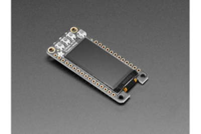
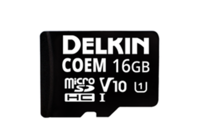
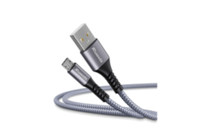
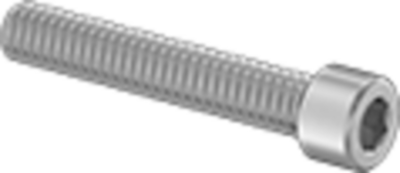
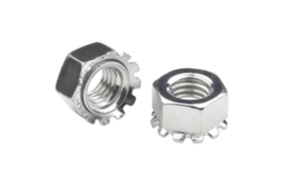

**Featherwing Components**

| Component | Image | Description | Link |
| :---- | :---- | :---- | :---- |
| Feather M0 WiFi (WINC1500) |  | Microcontroller and Wifi Radio It is equivalent to the CPU of a computer. | [https://www.adafruit.com/product/3010](https://www.adafruit.com/product/3010) |
| Featherwing Logger (RTC microSD) |  | Real-time Clock and MicroSD Reader It works like the memory and data storage of a computer. | [https://www.adafruit.com/product/2922](https://www.adafruit.com/product/2922) |
| Featherwing OLED 128x64 |  | Display It is equivalent to the computer screen. | [https://www.adafruit.com/product/4650](https://www.adafruit.com/product/4650) |

**Sensors**

| Component | Image | Description | Link |
| :---- | :---- | :---- | :---- |
| Adafruit SCD41 CO2 |  | CO2 Sensor | [https://www.adafruit.com/product/5190](https://www.adafruit.com/product/5190) |
| BME280 Temp. Press. Rel Humidity |  | Temp. Pressure Humidity Sensor | [https://www.digikey.com/en/products/detail/adafruit-industries-llc/2652/5604372](https://www.digikey.com/en/products/detail/adafruit-industries-llc/2652/5604372) |
| Sensirion SEK-SEN5X |  | Particulate Matter/VOC/NOX Sensor | [https://www.digikey.com/en/products/detail/sensirion-ag/SEN55-SDN-T/16342756](https://www.digikey.com/en/products/detail/sensirion-ag/SEN55-SDN-T/16342756) |

**Additional Parts**

| Part | Image | Description | Link |
| :---- | :---- | :---- | :---- |
| MiniBoost 5V |  | 3.3 to 5 Voltage Converter | [https://www.adafruit.com/product/4654](https://www.adafruit.com/product/4654) |
| Battery Coin cr1220 |  | Battery (Coin) | [https://www.digikey.com/en/products/detail/renata-batteries/RENATA-CR1220-TS-1/13283109](https://www.digikey.com/en/products/detail/renata-batteries/RENATA-CR1220-TS-1/13283109) |
| Micro SD |  | (Physical) Data Storage | [https://www.digikey.com/en/products/detail/delkin-devices-inc/USDCOEM-16GB/13882332](https://www.digikey.com/en/products/detail/delkin-devices-inc/USDCOEM-16GB/13882332) |
| 4 Pin Headers |  | 4 Pin Header for 3.3 to 5 Volt. Converter | [https://www.digikey.com/en/products/detail/sullins-connector-solutions/PPTC041LFBN-RC/810144](https://www.digikey.com/en/products/detail/sullins-connector-solutions/PPTC041LFBN-RC/810144) |
| 5 Pin Headers |  | 5 Pin Header for SCD 41 | [https://www.digikey.com/en/products/detail/sullins-connector-solutions/PPTC051LFBN-RC/807239](https://www.digikey.com/en/products/detail/sullins-connector-solutions/PPTC051LFBN-RC/807239) |
| 6 Pin Headers |  | 6 Pin Header for Particulate Matter Sensor | [https://www.digikey.com/en/products/detail/würth-elektronik/61300611821/16608482](https://www.digikey.com/en/products/detail/würth-elektronik/61300611821/16608482) |
| 7 Pin Headers |  | 7 Pin Header for BME280 and SCD30 | [https://www.digikey.com/en/products/detail/sullins-connector-solutions/PPTC071LFBN-RC/810146](https://www.digikey.com/en/products/detail/sullins-connector-solutions/PPTC071LFBN-RC/810146) |
| 12 Pin Headers |  | 12 Pin Header for Feather Logger and M0 | [https://www.digikey.com/en/products/detail/sullins-connector-solutions/PPTC121LFBN-RC/807231](https://www.digikey.com/en/products/detail/sullins-connector-solutions/PPTC121LFBN-RC/807231) |
| 16 Pin Headers |  | 16 Pin Header for Feather Logger and M0 | [https://www.digikey.com/en/products/detail/sullins-connector-solutions/PPTC161LFBN-RC/810154](https://www.digikey.com/en/products/detail/sullins-connector-solutions/PPTC161LFBN-RC/810154) |
| Feather Stacking Header Set |  | Stacking header for Feather M0 | [https://www.adafruit.com/product/2830](https://www.adafruit.com/product/2830) |
| Grove Female Header - DIP-4P-2.0mm |  | i2c Grove Connector | [https://www.seeedstudio.com/Grove-Universal-4-pin-connector.html](https://www.seeedstudio.com/Grove-Universal-4-pin-connector.html) |
| CSL_AQS_V1 PCB Board (KiCAD) |  | PCB Board | [https://www.pcbway.com/](https://www.pcbway.com/) [https://github.com/Community-Sensor-Lab/Air-Quality-Sensor/tree/CSL_AQS_V5](https://github.com/Community-Sensor-Lab/Air-Quality-Sensor/tree/CSL_AQS_V5) |
| PVC Tube |  | PVC 3 Inch Diameter 7 Inch LengthTube | [https://www.homedepot.com/p/Charlotte-Pipe-3-in-x-2-ft-PVC-DWV-Sch-40-Pipe-PVC073000200HA/100533056](https://www.homedepot.com/p/Charlotte-Pipe-3-in-x-2-ft-PVC-DWV-Sch-40-Pipe-PVC073000200HA/100533056) |
| PVC Cap |  | PVC Cap 3 Inch Diameter | [https://www.homedepot.com/p/3-in-PVC-DWV-Cap-PVC001161000HD/203393254](https://www.homedepot.com/p/3-in-PVC-DWV-Cap-PVC001161000HD/203393254) |
| Type C Cable |  | Micro USB Cable | [https://www.amazon.com/Ruaeoda-Micro-Android-Charger-Gold-Plated/dp/B0D7RZJSPS/ref=sr_1_10?s=industrial&sr=1-10](https://www.amazon.com/Ruaeoda-Micro-Android-Charger-Gold-Plated/dp/B0D7RZJSPS/ref=sr_1_10?s=industrial&sr=1-10) |
| Grainger #6 Screw |  | 6-32 x 1/2'' Socket Head Screw | [https://www.mcmaster.com/catalog/130/3555/92196A146](https://www.mcmaster.com/catalog/130/3555/92196A146) |
| Grainger #6 Screw |  | 6-32 x 1/2'' Phillip Head Screw | [https://a.co/d/00aQRtf8](https://a.co/d/00aQRtf8) |
| 6#-32 Lock Nuts |  | 6#-32 Lock Nuts | [https://www.amazon.com/dp/B09V2SMKCS?ref=cm_sw_r_cp_ud_dp_85DV0K4XSP3YVNZTQ9CF&ref_=cm_sw_r_cp_ud_dp_85DV0K4XSP3YVNZTQ9CF&social_share=cm_sw_r_cp_ud_dp_85DV0K4XSP3YVNZTQ9CF&skipTwisterOG=2&th=1](https://www.amazon.com/dp/B09V2SMKCS?ref=cm_sw_r_cp_ud_dp_85DV0K4XSP3YVNZTQ9CF&ref_=cm_sw_r_cp_ud_dp_85DV0K4XSP3YVNZTQ9CF&social_share=cm_sw_r_cp_ud_dp_85DV0K4XSP3YVNZTQ9CF&skipTwisterOG=2&th=1) |
| 11mm, M2.5 Standoffs |  | 100 Pcs M2.5 11mm Standoffs | [https://www.amazon.com/dp/B0BK99T8S4?_encoding=UTF8&psc=1&ref=cm_sw_r_cp_ud_dp_NJHTWAXYMZAMQTEPGTWG&ref_=cm_sw_r_cp_ud_dp_NJHTWAXYMZAMQTEPGTWG&social_share=cm_sw_r_cp_ud_dp_NJHTWAXYMZAMQTEPGTWG&skipTwisterOG=2](https://www.amazon.com/dp/B0BK99T8S4?_encoding=UTF8&psc=1&ref=cm_sw_r_cp_ud_dp_NJHTWAXYMZAMQTEPGTWG&ref_=cm_sw_r_cp_ud_dp_NJHTWAXYMZAMQTEPGTWG&social_share=cm_sw_r_cp_ud_dp_NJHTWAXYMZAMQTEPGTWG&skipTwisterOG=2) |
| Hex Nuts, M2.5x0.45mm |  | 100 Pcs M2.5x0.45mm Hex Nuts | [https://www.amazon.com/dp/B07H3WGLJN?_encoding=UTF8&psc=1&ref=cm_sw_r_cp_ud_dp_YWEFJ3H8FVGTAFAJ55B1&ref_=cm_sw_r_cp_ud_dp_YWEFJ3H8FVGTAFAJ55B1&social_share=cm_sw_r_cp_ud_dp_YWEFJ3H8FVGTAFAJ55B1&skipTwisterOG=2](https://www.amazon.com/dp/B07H3WGLJN?_encoding=UTF8&psc=1&ref=cm_sw_r_cp_ud_dp_YWEFJ3H8FVGTAFAJ55B1&ref_=cm_sw_r_cp_ud_dp_YWEFJ3H8FVGTAFAJ55B1&social_share=cm_sw_r_cp_ud_dp_YWEFJ3H8FVGTAFAJ55B1&skipTwisterOG=2) |
| M2.5x6mm Screws |  | 100 Pcs M2.5x6mm Screws | [https://www.amazon.com/dp/B01B1PGR22?_encoding=UTF8&psc=1&ref=cm_sw_r_cp_ud_dp_V3CT5FRAVAEGDJX2H49D&ref_=cm_sw_r_cp_ud_dp_V3CT5FRAVAEGDJX2H49D&social_share=cm_sw_r_cp_ud_dp_V3CT5FRAVAEGDJX2H49D&skipTwisterOG=2](https://www.amazon.com/dp/B01B1PGR22?_encoding=UTF8&psc=1&ref=cm_sw_r_cp_ud_dp_V3CT5FRAVAEGDJX2H49D&ref_=cm_sw_r_cp_ud_dp_V3CT5FRAVAEGDJX2H49D&social_share=cm_sw_r_cp_ud_dp_V3CT5FRAVAEGDJX2H49D&skipTwisterOG=2) |